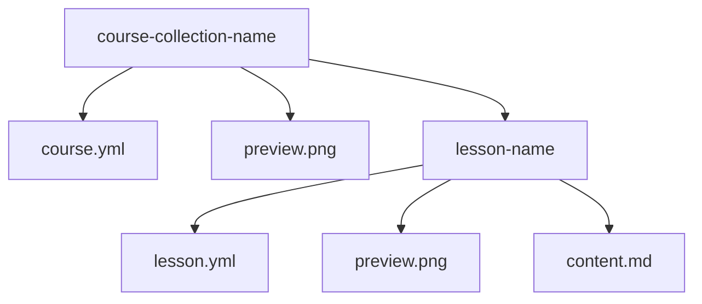

## Vocabulary

@see [Glossar](../80_Glossar/glossar.md)

We reintroduce some terms from the glossar here, to make them more visible and help non german speakers to understand the structure.

- **Course Collection**: A course collection is a collection of one or more courses.
- **Course**: A course is a collection of lessons
- **Lesson**: A lesson is a single unit of content.
- **OER**: Open Educational Resources are resources that are free to use and distribute.
- **Learning Portal**: The [Application](https://github.com/fsfw-dresden/learning-portal) that provides the user interface and the functionality to browse, search and play the courses.
- **Schulstick**: The debian based Live system, with preinstalled, preconfigured and ready to use applications and OER materials.

## Courses Origin

OER materials for the learning portal can be hosted in individual repositories and contain
one or more courses, which themself consist of one or more lessons.

This **Learning Portal** repository contains some example courses within the [OER-materials](https://github.com/fsfw-dresden/learning-portal/tree/main/OER-materials) folder.

Preinstalled courses packaged for the Schulstick are located in `/usr/share/learning-portal/courses/examples`

It is by no means required to package your courses into debian packages. But if you do so, you should place them into `/usr/share/learning-portal/courses/[course_collection_name]`

For a hypotetic collection of blender courses a lesson of one of the courses would be stored under:

`/usr/share/learning-portal/courses/org_gitlab_artist_blender/sculpture-course/unit01`

### Reserved collection names

The following collection names are reserved and should not be used for your own courses:

- `examples` - used for example courses from the learning portal repository
- `draft` 
- `private`
- `unpublished`

the `draft`, `private` and `unpublished` collections are used to store courses that are not yet published.

### Course collection name

Conventionally `course_colection_name` should be something like`org_gitlab_user_repo` to prevent naming clashes

### User added courses

Users can create their own courses by placing them in `$HOME/.local/share/learning-portal/courses/draft|private|unpublished` and they will automatically be added to the course list.

Or they can download courses and corse collections (manually or by using the portal app) them to `$HOME/.local/share/learning-portal/courses/[course_collection_name]`

## Course Format and Folder Structure




Because we follow a convention over configuration approach, the course folder structure is as follows, but can be reconfigured in the `course.yml` file in order to support different content types or a completely different folder structure.

### LiaScript

LiaScript is a markdown-based authoring framework for creating interactive learning experiences. If nothing else is specified in the `course.yml` file, LiaScript will be used to render the course.

```
course-best-practice/ (free naming)
├── course.yml (optional course metadata)
├── preview.png (optional course preview image)
├── lesson-01/ (lesson folder, can be named freely)
│   ├── lesson.yml (optional lesson metadata)
│   ├── preview.png (optional lesson preview image)
│   └── content.md (lesson content name unless specified otherwise in lesson.yml)
├── lesson-02/
│   ├── lesson.yml 
│   ├── preview.png 
│   └── content.md 
└── ...
```

A minimal example of course collection would look like this:

```
course-name/
├── lesson-name/
│   └── content.md
```

A more concrete example:

``` 
Blender-beginner/ 
├── course.yml 
├── preview.png 
├── 01-navigation/ 
│   ├── lesson.yml 
│   ├── preview.png 
│   └── content.md 
├── 02-modeling/
│   └── ...
├── 03-materials/
│   └── ...
├── 04-lighting/
│   └── ... 
└── ...

Blender-game-development/
├── course.yml 
├── preview.png 
├── 01-scene-setup/
│   ├── lesson.yml 
│   ├── preview.png 
│   └── content.md
├── 02-animations/
│   ├── lesson.yml 
│   ├── preview.png 
│   └── content.md
└── ...
Blender-Godot-Integration/
├── course.yml 
├── preview.png 
├── 01-scene-setup/
│   └── ...
├── 02-import-blender-models/
│   └── ...
└── ...
```

Lesson folder names can be freely chosen, but the alphabetical order is used to determine the display order of the lessons.

### MDBook

MDBook is a markdown-based authoring framework for creating books.

We also support MDBook, but it is not the default renderer.

The mdbook renderer will be chosen if the `renderer` field in the `course.yml` file is set to `mdbook` or if a `SUMMARY.md` file is present in the course folder.

A minimal example course folder for mdbook would look like this:

```
course-name/
├── SUMMARY.md
├── chapter-01/
│   └── content.md
```
