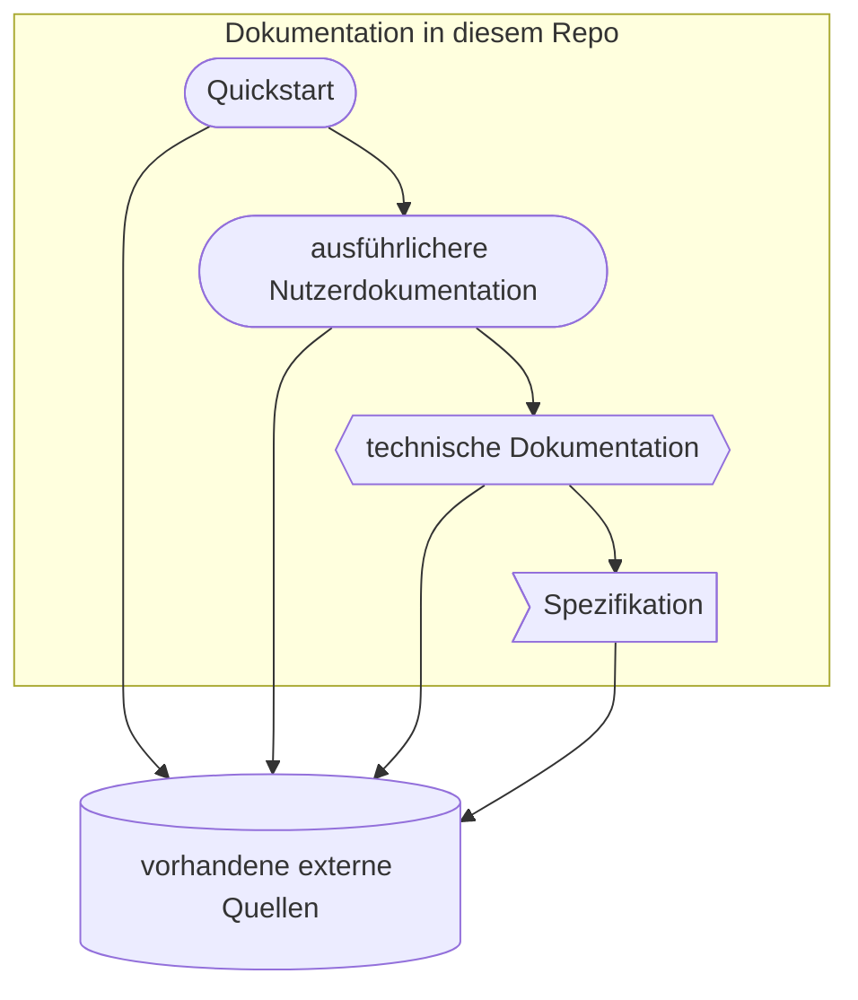
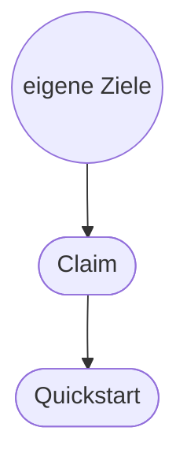

### [TL;DR](https://en.wikipedia.org/wiki/TL;DR)

Hier findest du Dokumentation zum
* **[Schulstick](Schulstick/schulstick.md)** (Quellen, Download, Installation, Booten, Starten per VM)
* und ein **[Quickstart-Tutorial](Quickstart/quickstart.md)**, dass erklärt, wie Lerninhalte für den Schulstick erzeugt werden können.

### Über diese Dokumentation

In diesem [Repo](https://de.wikipedia.org/wiki/Repository#Software-Repository) entsteht die Dokumentation für das [Schulstick Portal](https://github.com/fsfw-dresden/schulstick-portal).

Die Dokumention wird automatisch von einer [CI/CD](https://de.wikipedia.org/wiki/CI/CD)-Pipeline gebaut und ist [hier verfügbar](https://fsfw-dresden.github.io/schulstick-tutorial-docs/).

### Inhalte (in Arbeit)

* Zunächst wird ein [Quickstart-Tutorial](Quickstart/quickstart.md) erstellt
  * Wir wollen den Quickstart so kurz wie möglich halten, aber so hilfreich wie möglich gestalten. Um das ermöglichen zu können, haben wir folgende Überlegungen:
    * Das Portal soll [Convention over configuration](https://en.wikipedia.org/wiki/Convention_over_configuration) umsetzen. Wir wollen minimalen Aufwand von den Tutorialserstellern (nur eine Markdown-Datei) und haben selber die geeigneten Defaults statt der Notwendigkeit zu zusätzlichen Konfigurationen.
    * Der Quickstart bewirbt und Dokumentiert endnutzerfreundlich einen Bestcase der Einfachheit. Er bindet uns gleichzeitig daran, genau nach diesem Anspruch zu Entwickeln.
    * Um den Quickstart so kurz wie möglich halten zu können und gleichzeitig alle Notwendigen Hinweise/Erklärungen/Problemlösungen bereitzustellen, arbeiten wir mit Links zu eigenen Ergänzungen. Wir liefen viele Referenzen auf ausführlichere eigene Dokumentation.

* Die zusätzlich notwendigen ausführlicheren Dokumentationen / Spezifikationen werden ebenfalls in diesem Verzeichnis erarbeitet.

Der Quickstart stellt einerseits Anforderungen an die technische Umsetzung. Wir sind überzeugt, dass es sicht lohnt die Spezifikation an möglichst simple Minimalbeispiele anzupassen, weil sich genau das aus unseren Zielen ergibt. Dise bewusste Design-Entscheidung könnte als eine Art Versprechen / Claim / Anspruch an uns selbst verstanden und auch als Berbebotschaft verwendet werden.

* Um den Quickstart als Grundlage für die Umsetzung entsprechend umsetzen zu können, Enthällt dieses Repo auch eine Formulierung unserer [Ziele](./Ziel/ziel.md) und [Versprechen](./Claim/claim.md)…

* Um einheitliche Begriffe (und vielleicht einprägsamme „Markennamen“) zu haben, wird ein [Glossar](Glossar/glossar.md) erstellt.
